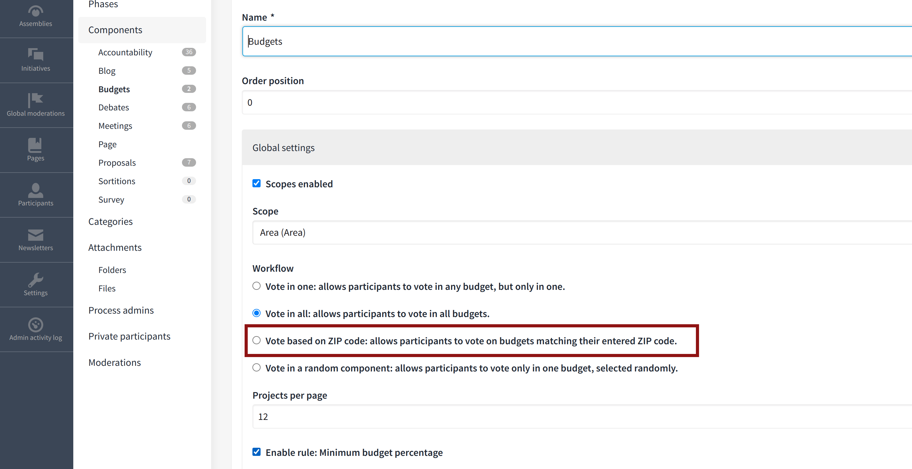

# Decidim::BudgetsBooth

The purpose of this module is to improve the budgeting voting process to help users to focus on the primary action and hide all the irrelevant information and distractions from the user that may lead to the user not understanding that their vote has not been cast. The idea is to "lock" the user inside a voting booth during the voting process and make it extremely clear for them that if they exit the voting booth, they have not yet cast their vote.

The module also introduces a new budgeting workflow called "ZIP code". This workflow allows limiting the budgets available for the user based on their ZIP code, providing them only those budgets they are eligible to vote at. For more information and how to set this up, please refer to the [ZIP code voting documentation](docs/ZIP_CODE_VOTING.md).
## Usage

This module is built on top of the `decidim-budgets` module and adds extra feature/capabilities to it. After installing this module, the normal budgeting component will automatically provide the voting booth capabilities meaning if you do not want these capabilities, you should uninstall this module.
For enabling the "ZIP code voting" feature, you have a new workflow available for the budgets component named "ZIP code" which shows up at the configuration page as follows:

This workflow enables the following features to the budget voting experience:
- Capability for enabling/disabling "ZIP code" workflow from components configuration.
- Capability for the user to provide their ZIP code when entering the voting booth.
  * Users may change their zip code only if they have not voted yet, or if they have deleted all of their votes.
- Defining cancel and after finishing voting redirection destinations.
  * Useful for asking for feedback, for example, after completing voting.
- Introducing a new configuration for maximum number of budgets, in which users can vote.
- Adding after voting and after completing voting message, configurable from admin panel.
- Capability of showing/hiding voting instruction, when the user starts to vote.
- Capability of showing images in the after voting popup.
- Capability of adding images to the budgets from back office, to be displayed at the budgets listing page.

## Installation

Add this line to your application's Gemfile:

```ruby
gem "decidim-budgets_booth", github: "Pipeline-to-Power/decidim-module-ptp", branch: "main"
```

And then execute:

```bash
bundle
```

## Configuration

### Admin configuration
To configure this module correctly, you need to first configure the ZIP codes correctly. Please refer to the [ZIP code voting documentation](docs/ZIP_CODE_VOTING.md) for more information on how to set it up. Next, you can configure the following options from your budgets component configurations:
- **Vote based on ZIP code:** allows participants to vote on budgets matching their entered ZIP code.
  * Selecting this option enables ZIP code workflow.
  * Any other workflow will work as Decidim would normally work but with the voting booth feature enabled.
- **Popup text after each vote:** the content of the popup which is being shown after each voting.
- **Popup text after voting in all available budgets:** the content of the popup which is being shown after user voted in all available budgets.
- **Terms and conditions to be shown when user wants to enter their ZIP code:** set of terms and conditions you ask the users to agree on when they are entering their ZIP code.
  * This message is shown in ZIP code entering view when using the ZIP code voting.
  * Otherwise, this message will show up when the user is about to confirm their vote.
- **URL to redirect user after voting on all available budgets:** Defines where user is redirected after completing their vote.
  * By default, the user is redirected back to the budgets list.
- **URL to redirect user when canceling voting:** Defines where the user is redirected if they decide to cancel the voting process.
  * By default, the user is redirected to the root path.
- **Show full project descriptions on the listing page and disable the details popup:** This option shows the complete project descriptions on the projects listing page while voting. If this setting is disabled, the descriptions will show up as "teasers" and the whole details are opened within a modal window.

### Hard coded configuration

You can set the number of digits for the ZIP codes which may differ in different countries. The default is set to 5, which is the case for those countries considered when this module was developed. If you need set this to a different number, you can use the following code within an initializer to change this setting:
```ruby
Decidim::BudgetsBooth.configure do |config|
  # Change this value to the number of characters in the ZIP codes within the country where this instances is used at.
  config.zip_code_length = 5
end

## Testing

To run the tests, run the following in the gem development path:

```bash
$ bundle
$ DATABASE_USERNAME=<username> DATABASE_PASSWORD=<password> bundle exec rake test_app
$ DATABASE_USERNAME=<username> DATABASE_PASSWORD=<password> bundle exec rspec
```

Note that the database user has to have rights to create and drop a database in
order to create the dummy test app database.

In case you are using [rbenv](https://github.com/rbenv/rbenv) and have the
[rbenv-vars](https://github.com/rbenv/rbenv-vars) plugin installed for it, you
can add these environment variables to the root directory of the project in a
file named `.rbenv-vars`. In this case, you can omit defining these in the
commands shown above.

## Test code coverage

If you want to generate the code coverage report for the tests, you can use
the `SIMPLECOV=1` environment variable in the rspec command as follows:

```bash
$ SIMPLECOV=1 bundle exec rspec
```

This will generate a folder named `coverage` in the project root which contains
the code coverage report.
