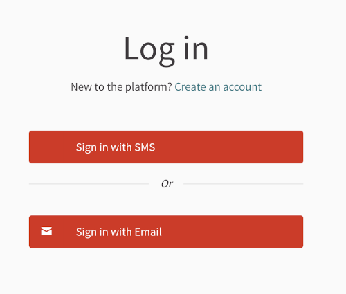

# Decidim::Smsauth

SMS based authentication implementation.

## Usage

The sign in process for Decidim is seen confusing and cumbersome during the most popular participatory budgeting voting
phase which generally draws the most attention. In order to make it simpler for the majority of the public, this module
provides an SMS based authentication flow during this working phase. After adding this module:

- Users can choose between the SMS authentication or email authentication based on their preferences at the login page.
- Users can enter their phone number (with a possible country code selection dropdown) after which a confirmation code
  will be sent to the provided phone number through the selected SMS sending operator service.
- Once the users enter the confirmation code to the platform, they can continue using Decidim normally. Before letting
  the user in, further details can be asked from the users, including their name, nickname and their email address.



## Installation

Add this line to your application's Gemfile:

```ruby
gem "decidim-smsauth", github: "Pipeline-to-Power/decidim-module-ptp", branch: "main"
```

And then execute:

```bash
bundle
```
## Configuration

Add the following to your secrets.yml file:

```yml
  omniauth:
    # Add this after other available authentication options:
    sms:
      enabled: true
      icon: phone
```

## Testing

To run the tests, run the following in the gem development path:

```bash
$ bundle
$ DATABASE_USERNAME=<username> DATABASE_PASSWORD=<password> bundle exec rake test_app
$ DATABASE_USERNAME=<username> DATABASE_PASSWORD=<password> bundle exec rspec
```

Note that the database user has to have rights to create and drop a database in
order to create the dummy test app database.

In case you are using [rbenv](https://github.com/rbenv/rbenv) and have the
[rbenv-vars](https://github.com/rbenv/rbenv-vars) plugin installed for it, you
can add these environment variables to the root directory of the project in a
file named `.rbenv-vars`. In this case, you can omit defining these in the
commands shown above.

## Test code coverage

If you want to generate the code coverage report for the tests, you can use
the `SIMPLECOV=1` environment variable in the rspec command as follows:

```bash
$ SIMPLECOV=1 bundle exec rspec
```

This will generate a folder named `coverage` in the project root which contains
the code coverage report.
